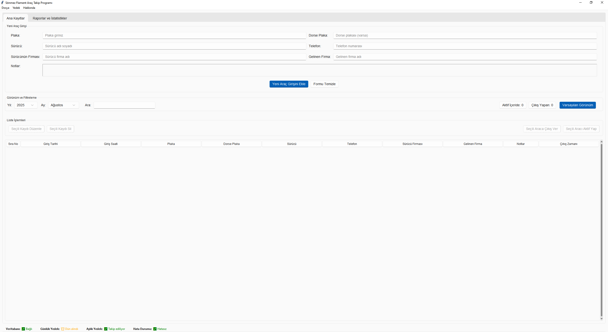

# Araç - Tır Takip Sistemi

Bu proje, bir tesis, fabrika, depo veya siteye giren ve çıkan araçların kaydını tutmak, raporlamak ve yönetmek için geliştirilmiş, Python ve Tkinter tabanlı modern bir masaüstü uygulamasıdır.

Kullanıcı dostu arayüzü sayesinde, herhangi bir özel eğitime ihtiyaç duymadan araç trafiğini kolayca yönetebilir ve geriye dönük olarak detaylı raporlar alabilirsiniz.

## ✨ Temel Özellikler

### 1\. Kayıt Yönetimi

  - **Detaylı Araç Girişi:** Plaka, dorse plakası, sürücü, telefon, firma bilgileri ve özel notlar gibi birçok detayı içeren yeni araç kayıtları oluşturma.
  - **Kayıt Güncelleme:** Mevcut kayıtlar üzerinde kolayca değişiklik yapma.
  - **Durum Takibi:** Araçlara tek bir tıkla "Çıkış Yaptı" veya "Tekrar Aktif" durumuna getirme.
  - **Güvenli Silme:** Yanlış kayıtları onay alarak kalıcı olarak silme.

### 2\. Gelişmiş Filtreleme ve Arama

  - **Tarih Bazlı Filtreleme:** Kayıtları yıl ve ay bazında kolayca filtreleme.
  - **Durum Filtreleri:** O anda "İçeride" olan veya "Çıkış Yapmış" araçları anında listeleme.
  - **Akıllı Arama:** Plaka, sürücü, firma gibi tüm alanlarda anlık arama yaparak istenen kayda saniyeler içinde ulaşma.

### 3\. Detaylı Raporlama

  - **Genel Bakış Paneli:** Belirlenen tarih aralığındaki toplam araç giriş sayısı, en yoğun firmalar, en sık gelen sürücüler ve araçlar gibi istatistiksel verileri grafiksel olarak görme.
  - **Özel Rapor Oluşturucu:**
      - Raporda yer alacak sütunları (plaka, sürücü, bekleme süresi vb.) seçme.
      - Gelişmiş filtrelere göre (firma, sürücü vb.) özel raporlar hazırlama.
      - Raporları **Excel**, **HTML** veya **PDF** formatlarında dışa aktarma.

### 4\. Otomatik Yedekleme ve Arşivleme Sistemi

  - **Otomatik Yedekleme:** Veritabanının tamamı için günlük ve aylık periyotlarda otomatik yedekleme.
  - **Manuel Yedekleme:** Tek tıkla anında yedek alma imkanı.
  - **Sıkıştırma Özelliği:** Yedek dosyalarını `.zip` formatında sıkıştırarak disk alanından tasarruf etme.
  - **Veri Arşivleme:** Performansı korumak amacıyla, belirlenen tarihten (örn: 1 yıldan) eski kayıtları ana veritabanından ayrı bir arşiv dosyasına taşıma.
  - **Yedekten Geri Yükleme:** Birkaç tıkla sıkıştırılmış veya normal yedek dosyalarından sistemi geri yükleme.

### 5\. Kullanıcı Dostu Arayüz ve Ayarlar

  - **Modern Tema:** `sv-ttk` kütüphanesi ile aydınlık ve karanlık tema seçenekleri.
  - **Kara Liste:** İstenmeyen araç veya sürücüleri kara listeye ekleyerek giriş anında uyarı alma.
  - **Detaylı Ayarlar Menüsü:** Yedekleme sıklığı, dosya saklama süreleri, tema ve sıkıştırma gibi birçok ayarı program içinden kolayca yönetme.
  - **Performans:** Çok sayıda kayıtla bile (1000+) programın hızlı çalışmasını sağlayan sanal liste (virtualized treeview) teknolojisi.

## 🛠️ Kullanılan Teknolojiler

  * **Dil:** Python 3
  * **Arayüz (GUI):** Tkinter, `sv-ttk` (tema için)
  * **Veritabanı:** SQLite 3
  * **Veri İşleme ve Raporlama:** Pandas, ReportLab
